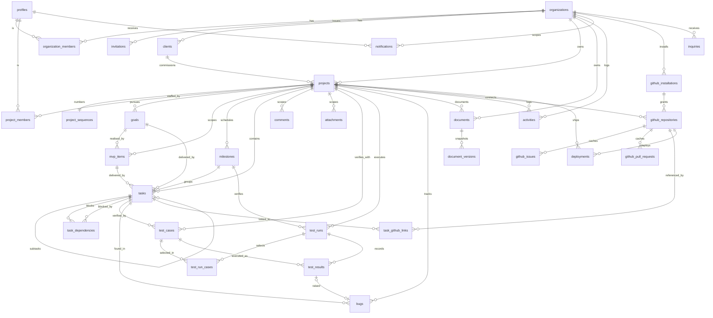

# Relationships and ERD

## Core graph



Polymorphic references (`comments`, `attachments`, `activities`, `notifications` via `entity_type` + `entity_id`) are not drawn as FKs because Postgres cannot enforce them across tables. They always carry `project_id` (or `organization_id`) so RLS is enforceable without resolving the target. The application validates target existence and same-project membership on write.

## Cardinalities that matter

| Relationship | Cardinality | Note |
|---|---|---|
| organization → project | 1 : n | |
| project → manager (profile) | n : 1 | nullable until activation |
| project → client | n : 0..1 | |
| project ↔ repository | 1 : 0..1 in v1 | `unique(repo_id)`; relax later |
| goal → mvp_item | 1 : n | mvp item may have no goal (warned) |
| mvp_item → task | 1 : n | task may have no mvp item |
| task → subtask | 1 : n, depth 1 | |
| task ↔ task (dependency) | n : n, acyclic | |
| task → reviewer | n : 0..1 | |
| test_case → test_result | 1 : n across runs | |
| test_run → test_case | n : n via test_run_cases | |
| test_result → bug | 0..1 : 0..1 | a result raises at most one bug; a bug comes from at most one result |
| bug → task | n : 0..1 | |
| document → versions | 1 : n | |
| task ↔ issue/PR | n : n via task_github_links | |

## Deletion semantics

| Parent deleted | Effect |
|---|---|
| organization | cascade everything (only via owner-only action; never in v1 UI) |
| profile (auth user) | memberships cascade; authored rows keep `created_by` (FK without cascade → set null where nullable, else prevented). Users are **removed from the organisation** rather than deleted. |
| project (hard) | not exposed; soft delete + 30-day restore, then cascade |
| goal / mvp_item / milestone | tasks keep existing with the link set null; activity records the deletion |
| task | soft; subtasks soft-deleted by action; dependencies and links cascade on eventual hard delete |
| test_case | soft; historical results keep pointing to it |
| test_run | cascade results (a run is a unit) |
| document | soft; versions cascade on eventual hard delete |
| github_repository | cascade cached issues/PRs and links; deployments keep row with null repository |

## Traceability query (the product promise)

"Which goal does this PR serve?" is one join path:

```text
github_pull_requests → task_github_links → tasks → mvp_items → goals
```

"Is MVP item X verified?":

```text
mvp_items → tasks → test_cases → test_results (latest per case) ∧ bugs (open, by task)
```

Both are implemented as SQL views (`v_task_traceability`, `v_mvp_verification`) used by the project overview and reports.
